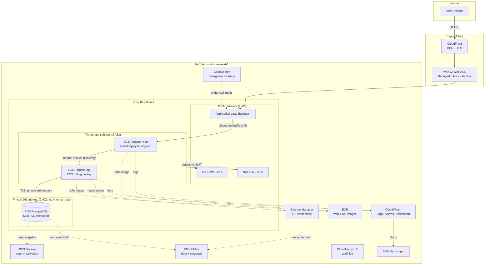

# Architecture

Production AWS architecture for the secure 3-tier Node.js application (project `toptal`, environment `prod`, region `us-east-1`).

## Diagram

## Tiers

| Tier | Compute | Reachability | Notes |
|---|---|---|---|
| Web | ECS Fargate, 2+ tasks across 2 AZs | Public via CloudFront -> WAF -> ALB | CodeDeploy blue/green (10% canary, 5 min bake) |
| API | ECS Fargate, 2+ tasks across 2 AZs | Private only -- Cloud Map service discovery, no ALB route | ECS-native rolling deploy (100% min healthy) |
| Database | RDS PostgreSQL, Multi-AZ | Private DB subnets only, no route to internet, SG allows API tier only | Automated backups + AWS Backup daily plan |

## Why these choices

- **CloudFront in front of an ALB, not S3 origin**: the app is server-rendered (Express + Pug), not static, so the origin must be compute. CloudFront still buys CDN caching for static assets, TLS termination at the edge, and a WAF attachment point.
- **ECS Fargate over EC2/EKS**: no node patching, no cluster control-plane to run, and the workload is two small stateless HTTP services -- Kubernetes' scheduling/networking model would be pure overhead here. Fargate + an ALB + Cloud Map covers everything this workload needs.
- **API has no ALB route**: it's only ever called by the web tier over the internal service-discovery DNS name. Exposing it on the public ALB would be an unused, unnecessary attack surface.
- **Blue/green for web, rolling for API**: CodeDeploy's traffic-shifting model needs a load balancer with two target groups. Web has one (the public ALB); API doesn't (internal, service-discovery only), so it uses ECS's native rolling deployment instead, which is still zero-downtime (100% minimum healthy percent means old tasks aren't killed until new ones pass health checks).
- **Multi-AZ RDS + per-AZ NAT Gateways**: both are here specifically to close the "handle AZ failure" requirement. A single NAT Gateway or a single-AZ database are the two most common "looks production-ready but isn't" mistakes in a 3-tier AWS design.

## Modules (Terraform)

`infrastructure/modules/`: `networking`, `security`, `alb`, `ecs`, `ecr`, `rds`, `secrets-manager`, `iam`, `kms`, `cloudfront`, `waf`, `cloudwatch`, `cloudtrail`, `backup`, `codedeploy`. See [infrastructure/README.md](../infrastructure/README.md) for the module graph and [DEPLOYMENT_GUIDE.md](DEPLOYMENT_GUIDE.md) for how they're wired together and applied.
